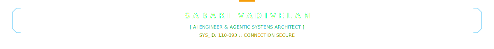

<!--
╔══════════════════════════════════════════════════════════════════╗
║           SABARI — PREMIUM AI ENGINEER GITHUB PROFILE           ║
╚══════════════════════════════════════════════════════════════════╝
-->

  

 

  

 

<table width="100%" border="0" cellspacing="0" cellpadding="0">
<tr>
<td width="55%" valign="top">

 

I engineer **end-to-end AI systems** — from pretraining Small Language Models to deploying agentic pipelines in production. My work spans the full ML lifecycle: data, architecture, training, evaluation, and inference optimization, alongside modern web development.

Currently building at the intersection of **LLMs**, **autonomous agents**, and **web applications** — with a particular interest in making AI systems that are efficient, interpretable, and robust.

 

> *"The best model is the one that solves the right problem."*

</td>
<td width="45%" valign="top" align="right">

 

</td>
</tr>
</table>

 

  

 

  

 

  

 

 

<table width="100%" border="0" cellspacing="0" cellpadding="12">
<tr>
<td valign="top" width="50%">

### 🔭 Observe

> **Agentic AI Assessment & Proctoring Platform**

An end-to-end intelligent examination platform powered by autonomous AI agents. Combines multi-modal monitoring, adaptive evaluation, and real-time decision-making into a seamless proctoring experience.

 

**Architecture Highlights:**
- Multi-agent orchestration via **LangGraph**
- Real-time monitoring with **computer vision**
- Adaptive AI evaluation pipeline with **Gemini + Groq**

 

  

</td>
<td valign="top" width="50%">

### 🛡️ CyberSLM

> **Small Language Model built completely from scratch**

A research project in building domain-specialized language models for cybersecurity — covering the entire stack from raw corpus to optimized inference.

 

**End-to-End Pipeline:**
- Custom **tokenizer training** (BPE from scratch)
- Full **pretraining** from random initialization
- **Instruction & Tool-use tuning**
- **Inference optimization** (quantization, ONNX export)

 

  

</td>
</tr>
</table>

 

  

 

  

 

<table width="100%" border="0" cellspacing="0" cellpadding="0">
<tr>
<td align="center" width="50%">

</td>
<td align="center" width="50%">

</td>
</tr>
</table>

 

  

 

<picture>
  <source media="(prefers-color-scheme: dark)" srcset="https://raw.githubusercontent.com/sabari2005/sabari2005/output/github-contribution-grid-snake-dark.svg"/>
  <source media="(prefers-color-scheme: light)" srcset="https://raw.githubusercontent.com/sabari2005/sabari2005/output/github-contribution-grid-snake.svg"/>
  
</picture>

 

  

Last updated by <a href="https://github.com/sabari2005">@sabari2005</a> · Portfolio: <a href="https://sabari-vadivelan.vercel.app/">sabari-vadivelan.vercel.app</a>

