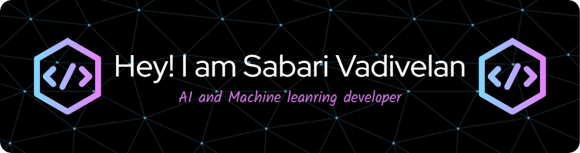

<!-- Profile Banner -->

I'm a passionate developer focused on AI, machine learning, and software development and tech enthusiast from India

---
### 🚀 About Me:
- 🤖 **AI Enthusiast**: I explore Machine Learning, Deep Learning, and Natural Language Processing.
- 📱 **Aspiring Android Developer**: Passionate about creating user-friendly mobile applications.
- 🎯 **Goal**: To make a meaningful impact through innovative solutions.
- ⚡ Fun fact: I love participating in hackathons and solving real-world problems.

<!-- Social Media Links -->

  
  
  

---

### 🛠️ **Technologies and Tools**

  
  
  
  
  
  
  
  
  

---

### 📈 **GitHub Stats**

  
  

---

### 🔥 **Streak and Contributions**

---

### 🤝 **Connect with Me**

  
  
  
  

---

### 💡 **Fun Fact**
> "I love building projects that make an impact and always explore new technologies!"

---

<!-- Custom Footer -->

🚀 Built with passion and dedication!

